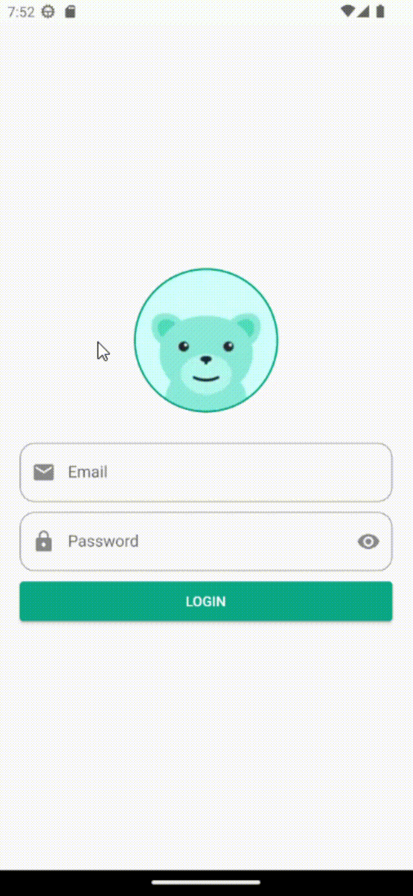

# Interactive Avatar Login Screen

This Flutter project features an **Interactive Avatar Login Screen** designed for mobile applications. The screen showcases an avatar that dynamically responds to user interactions, providing a visually engaging and intuitive login experience.

  
  

## Features

- **Dynamic Avatar:** The screen displays an avatar with various frames of motion that animate in response to user actions.
- **Motion Management:** The avatar reacts to user inputs, offering a responsive and lively UI experience.
- **Email and Password Fields:** Includes standard email and password text fields for user login.

## Usage

1. Launch the application.
2. Interact with the screen to see the avatar animate and respond to your actions.
3. Enter your email and password in the provided text fields.
4. Enjoy with this fantastic experience.

